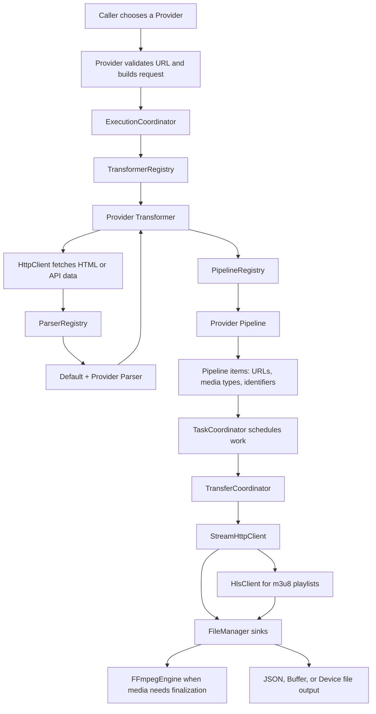

# downflux

Modular TypeScript media extraction and download toolkit. Each site integration is split into a provider, parser, transformer, and pipeline so extraction rules, output mapping, and download planning stay easy to update independently.

## Installation

```bash
npm install downflux
```

```bash
pnpm add downflux
```

## Usage

```ts
import { BeegProvider } from 'downflux';

const provider = new BeegProvider('https://beeg.com/example-video-url');
const result = await provider.getVideo();

console.log(result);
```

## FFmpeg Setup

DownFlux uses ffmpeg when HLS or fragmented media needs to be finalized into a playable file. The package includes `ffmpeg-static`, but some package managers can block its postinstall script.

If you use pnpm in the consuming app, approve the bundled binary build:

```bash
pnpm approve-builds
```

Select `ffmpeg-static`, then reinstall dependencies if needed.

You can also install ffmpeg yourself:

```bash
brew install ffmpeg
```

Then point DownFlux at that executable:

```ts
import { BeegProvider, OutputType } from 'downflux';

await new BeegProvider('https://beeg.com/example-video-url')
  .setOutput(OutputType.DEVICE, { directoryPath: 'downloads' })
  .setJobOptions({
    transcodeOptions: {
      ffmpegPath: '/opt/homebrew/bin/ffmpeg'
    }
  })
  .getVideo();
```

## Documentation

The generated Markdown API docs live in [`docs-md`](docs-md/README.md).

Useful entry points:

- [BaseProvider](docs-md/classes/BaseProvider.md) - public provider API and fluent execution options.
- [BaseParser](docs-md/classes/BaseParser.md) - shared HTML extraction helpers.
- [BaseTransformer](docs-md/classes/BaseTransformer.md) - fetches pages and normalizes parser output.
- [BasePipeline](docs-md/classes/BasePipeline.md) - turns extracted metadata into downloadable items.
- [ExecutionCoordinator](docs-md/classes/ExecutionCoordinator.md) - job-level extraction and output flow.
- [TaskCoordinator](docs-md/classes/TaskCoordinator.md) - concurrency, hooks, and background downloads.
- [TransferCoordinator](docs-md/classes/TransferCoordinator.md) - streams one pipeline item into storage.
- [HttpClient](docs-md/classes/HttpClient.md), [StreamHttpClient](docs-md/classes/StreamHttpClient.md), and [HlsClient](docs-md/classes/HlsClient.md) - HTTP and HLS engines.
- [FileManager](docs-md/classes/FileManager.md) and [FFmpegEngine](docs-md/classes/FFmpegEngine.md) - output sinks, filenames, JSON, and media finalization.
- [Provider](docs-md/enumerations/Provider.md), [OutputType](docs-md/enumerations/OutputType.md), [ExecutionType](docs-md/enumerations/ExecutionType.md), [VideoQuality](docs-md/enumerations/VideoQuality.md).

Regenerate the Markdown docs with:

```bash
pnpm run docs:md
```

## How The Service Works



In short: a provider creates a typed request, coordinators run the extraction/download flow, registries load the correct provider-specific classes, engines handle network transport, pipelines decide what should be downloaded, and storage writes or returns the result.

## Available Sites

| Site                                                    | Provider               | Short description                                                             |
| ------------------------------------------------------- | ---------------------- | ----------------------------------------------------------------------------- |
| [AnalRz](docs-md/classes/AnalRzProvider.md) <sup>new</sup>              | `AnalRzProvider`       | MP4 downloads; under development.                                             |
| [Beeg](docs-md/classes/BeegProvider.md)                 | `BeegProvider`         | MP4 downloads, HLS downloads; geo-sensitive, under development.               |
| [BlackPorn](docs-md/classes/BlackPornProvider.md) <sup>new</sup>        | `BlackPornProvider`    | MP4 downloads; under development.                                             |
| [BoKepPorn](docs-md/classes/BoKepPornProvider.md)       | `BoKepPornProvider`    | MP4 downloads, KVS metadata; under development.                               |
| [ColliderPorn](docs-md/classes/ColliderPornProvider.md) | `ColliderPornProvider` | MP4 downloads, HLS downloads, embeds; geo-sensitive, under development.       |
| [CumLouder](docs-md/classes/CumLouderProvider.md)       | `CumLouderProvider`    | MP4 discovery; under development.                                             |
| [DaFreePorn](docs-md/classes/DaFreePornProvider.md)     | `DaFreePornProvider`   | MP4 downloads, KVS metadata; under development.                               |
| [DaNude](docs-md/classes/DaNudeProvider.md)             | `DaNudeProvider`       | MP4 downloads, KVS metadata; under development.                               |
| [EpicGfs](docs-md/classes/EpicGfsProvider.md)           | `EpicGfsProvider`      | MP4 downloads, KVS metadata; under development.                               |
| [EPorner](docs-md/classes/EPornerProvider.md)           | `EPornerProvider`      | MP4 downloads, HLS downloads; external API, geo-sensitive, under development. |
| [HqPorn](docs-md/classes/HqPornProvider.md)             | `HqPornProvider`       | MP4 downloads; under development.                                             |
| [Interracial](docs-md/classes/InterracialProvider.md)   | `InterracialProvider`  | MP4 downloads, KVS metadata; under development.                               |
| [ItsPorn](docs-md/classes/ItsPornProvider.md)           | `ItsPornProvider`      | MP4 downloads, KVS metadata; under development.                               |
| [Lesbian8](docs-md/classes/Lesbian8Provider.md)         | `Lesbian8Provider`     | MP4 downloads, KVS metadata; under development.                               |
| [MegaTube](docs-md/classes/MegaTubeProvider.md)         | `MegaTubeProvider`     | MP4 downloads, KVS metadata; under development.                               |
| [MomVids](docs-md/classes/MomVidsProvider.md)           | `MomVidsProvider`      | MP4 downloads, KVS metadata; under development.                               |
| [MyLust](docs-md/classes/MyLustProvider.md)             | `MyLustProvider`       | MP4 downloads; under development.                                             |
| [OkPorn](docs-md/classes/OkPornProvider.md)             | `OkPornProvider`       | HLS downloads; under development.                                             |
| [PerfectGirls](docs-md/classes/PerfectGirlsProvider.md) | `PerfectGirlsProvider` | HLS downloads; under development.                                             |
| [Porn300](docs-md/classes/Porn300Provider.md)           | `Porn300Provider`      | MP4 discovery; under development.                                             |
| [PornDoe](docs-md/classes/PornDoeProvider.md)           | `PornDoeProvider`      | MP4 downloads; external API, under development.                               |
| [PornHub](docs-md/classes/PornHubProvider.md)           | `PornHubProvider`      | MP4 downloads, HLS downloads, KVS metadata; under development.                |
| [PornId](docs-md/classes/PornIdProvider.md)             | `PornIdProvider`       | MP4 downloads, KVS metadata; under development.                               |
| [PornOne](docs-md/classes/PornOneProvider.md)           | `PornOneProvider`      | MP4 downloads; Cloudflare challenge, under development.                       |
| [PornSeven](docs-md/classes/PornSevenProvider.md)       | `PornSevenProvider`    | MP4 discovery; under development.                                             |
| [PornsOk](docs-md/classes/PornsOkProvider.md)           | `PornsOkProvider`      | MP4 downloads; under development.                                             |
| [PussySpace](docs-md/classes/PussySpaceProvider.md)     | `PussySpaceProvider`   | MP4 downloads; external API, under development.                               |
| [SexVid](docs-md/classes/SexVidProvider.md)             | `SexVidProvider`       | MP4 downloads, KVS metadata; under development.                               |
| [Shameless](docs-md/classes/ShamelessProvider.md)       | `ShamelessProvider`    | MP4 downloads, KVS metadata; under development.                               |
| [SuperPorn](docs-md/classes/SuperPornProvider.md)       | `SuperPornProvider`    | MP4 downloads; under development.                                             |
| [SxyPorn](docs-md/classes/SxyPornProvider.md)           | `SxyPornProvider`      | MP4 downloads; Cloudflare challenge, under development.                       |
| [TheyAreHuge](docs-md/classes/TheyAreHugeProvider.md)   | `TheyAreHugeProvider`  | MP4 downloads, KVS metadata; login required, under development.               |
| [TnAFlix](docs-md/classes/TnAFlixProvider.md)           | `TnAFlixProvider`      | MP4 downloads; geo-sensitive, under development.                              |
| [TubeVSex](docs-md/classes/TubeVSexProvider.md)         | `TubeVSexProvider`     | MP4 downloads; under development.                                             |
| [WallHaven](docs-md/classes/WallHavenProvider.md)       | `WallHavenProvider`    | Provider-specific extraction; under development.                              |
| [XCafe](docs-md/classes/XCafeProvider.md)               | `XCafeProvider`        | MP4 downloads; under development.                                             |
| [XDegu](docs-md/classes/XDeguProvider.md)               | `XDeguProvider`        | MP4 downloads, KVS metadata; under development.                               |
| [XGroovy](docs-md/classes/XGroovyProvider.md)           | `XGroovyProvider`      | MP4 downloads; under development.                                             |
| [XHamster](docs-md/classes/XHamsterProvider.md)         | `XHamsterProvider`     | MP4 downloads, HLS downloads; under development.                              |
| [XnXX](docs-md/classes/XnXXProvider.md)                 | `XnXXProvider`         | MP4 downloads, HLS downloads; under development.                              |
| [Xozilla](docs-md/classes/XozillaProvider.md)           | `XozillaProvider`      | MP4 downloads, KVS metadata; under development.                               |
| [XVideos](docs-md/classes/XVideosProvider.md)           | `XVideosProvider`      | MP4 discovery, HLS downloads, KVS metadata; under development.                |
| [ZbPorn](docs-md/classes/ZbPornProvider.md)             | `ZbPornProvider`       | MP4 downloads, KVS metadata; under development.                               |
| [ZzzTube](docs-md/classes/ZzzTubeProvider.md)           | `ZzzTubeProvider`      | MP4 downloads; under development.                                             |

More incoming...

## Development

```bash
pnpm install
pnpm run build
pnpm run docs:md
```

The generated docs are intentionally linked from this README so provider and API documentation remain browsable from the repository root.

## Publishing

```bash
pnpm run pack:dry-run
pnpm publish
```

`pnpm run pack:dry-run` rebuilds the package and previews the files that npm will receive.
